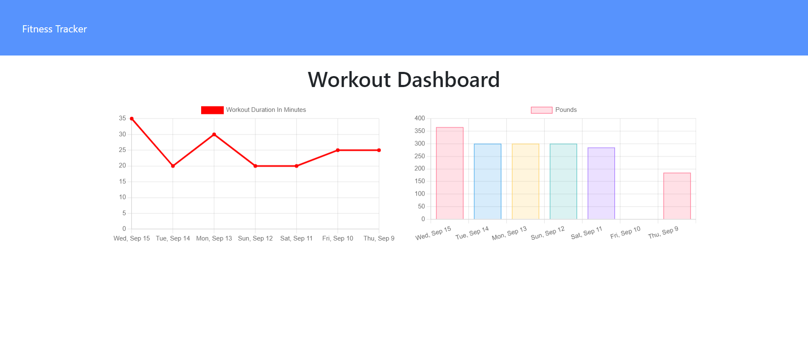

# Workout-Tracker

[Link to Deployed App](https://dashboard.heroku.com/apps/mighty-spire-96358)

## Description

An app that allows users to create and track workouts. Users are able to log multiple exercises in a workout as well as the name, type, weight, sets, reps, and duration of each exercise. Users may pick between two types of exercises: Resistance and Cardio.  The Dashboard displays a graph with total weight lifted for each of the last seven exercises. It also displays a graph with the total duration of each of the last seven workouts.

## Table of Contents

- [Usage](#usage)
- [Technologies Used](#technologies-used)
- [Questions](#questions)

## Usage

1. Visit the [Workout Tracker App](https://dashboard.heroku.com/apps/mighty-spire-96358)

2. Click New Workout to start a workout

Homepage view for new users:

3. Select a workout type

4. Enter the workout details
5. Press 'Complete' to add the exercise to the workout or
    -    Press 'Add Exercise' to add the exercise to the workout and then enter the details for another exercise

6. The app will return to the homepage and display the details for the last workout

7. Click the 'Dashboard' button to see data for the last 7 workoutSeed

## Technologies Used

* Javascript
* Node.js
* Express.js
* MongoDB
* Mongoose.js
* Heroku

## Questions

For any additional questions please reach out to me at:

[My Github Profile](https://github.com/AdrianCronin)

[Email](mailto:acronindev@gmail.com)

